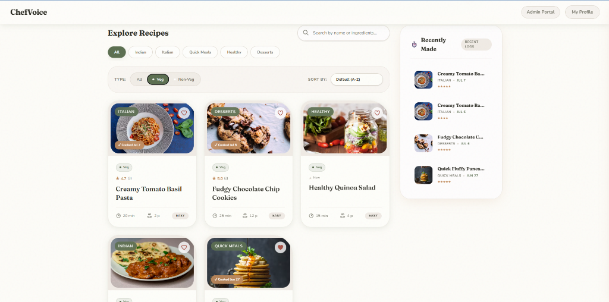

# ChefVoice App



A voice-first AI cooking assistant with real-time audio streaming, semantic recipe search, and a conversational web UI.

Navigate cooking steps hands-free, set smart timers, ask questions about ingredients, and receive high-fidelity spoken guidance — all powered by a streaming AI architecture.

---

## Features

| Feature | Description |
| --- | --- |
| **Hands-Free Navigation** | Navigate through recipe steps completely hands-free using natural language commands like "next step" or "what was the first step?". |
| **Barge-In Capabilities** | The assistant is truly conversational. Interrupt the AI mid-sentence and it will instantly stop talking and listen to your new command. |
| **Browser Voice Synthesis** | Spoken replies use the browser Web Speech API (no cloud TTS required). |
| **RAG Pipeline** | Recipes are embedded with `all-MiniLM-L6-v2` and stored in Supabase with `pgvector` for cosine similarity semantic search. |
| **Tool-Calling LLM** | NVIDIA NIM (`mistralai/mistral-nemotron`) runs a structured tool-calling agent loop for search, timers, navigation, shopping list, and more. |
| **Speech-to-Text Input** | Deepgram `nova-2` streaming API provides sub-second, highly accurate transcription of continuous audio streams. |
| **Intelligent Timers** | Context-aware timer management (e.g., "set a timer for the pasta"). Timers are fully controllable via voice. |

---

## Getting Started

### Prerequisites
* Python 3.9+
* Node.js 16+ and npm
* A [Supabase](https://supabase.com/) account for Postgres/Vector storage

### Local Development

1. **Clone the repository**
   ```bash
   git clone <repository-url>
   cd texttovoice
   ```

2. **Install and run the backend**
   ```bash
   cd backend
   python -m venv .venv
   
   # Activate virtual environment
   # Windows: .venv\Scripts\activate
   # macOS/Linux: source .venv/bin/activate
   
   pip install -r requirements.txt
   
   # Run Supabase migrations (schema.sql, migration.sql, migration_agent.sql)
   # Seed recipe embeddings
   python seed_embeddings.py
   
   # Start the FastAPI dev server on http://localhost:8000
   uvicorn main:app --reload
   ```

3. **Install and run the frontend (separate terminal)**
   ```bash
   cd frontend
   
   # Install Node dependencies
   npm install
   
   # Start the Vite dev server
   npm run dev
   ```

4. **Open in browser**
   Navigate to the URL provided by Vite (usually `http://localhost:5173`) to use the app with hot-reloading.

---

## Environment Variables

Create `.env` files in both the `backend/` and `frontend/` directories.

**Backend (`backend/.env`)**
| Variable | Description |
| --- | --- |
| `DEEPGRAM_API_KEY` | Your Deepgram API key for real-time ASR |
| `NVIDIA_API_KEY` | Your NVIDIA API key for NIM chat + tool calling |
| `NVIDIA_MODEL` | Optional model id (default `mistralai/mistral-nemotron`) |
| `SUPABASE_URL` | Your Supabase project URL |
| `SUPABASE_SERVICE_KEY` | Your Supabase service/anon key |

**Frontend (`frontend/.env`)**
| Variable | Description |
| --- | --- |
| `VITE_SUPABASE_URL` | Your Supabase project URL |
| `VITE_SUPABASE_ANON_KEY` | Your Supabase anon key for client-side Auth |
| `VITE_WS_URL` | Optional WebSocket base (default `ws://localhost:8000`) |

---

## Architecture Overview

### Tech Stack

#### Backend
| Technology | Purpose |
| --- | --- |
| **Python 3.9+** | Runtime language |
| **FastAPI** | Async web framework with robust WebSocket support |
| **Supabase / PostgreSQL** | Database storage with Row Level Security (RLS) |
| **pgvector** | Postgres extension for cosine-distance vector search |
| **Sentence-Transformers** | Local embedding generation (`all-MiniLM-L6-v2`) |
| **Deepgram** | Streaming Speech-to-Text (ASR) engine |
| **NVIDIA NIM API** | LLM orchestration with structured tool calling |
| **Web Speech API** | Browser text-to-speech (client-side) |

#### Frontend
| Technology | Purpose |
| --- | --- |
| **React 19** | UI framework |
| **Vite 8** | Build tool and dev server |
| **Tailwind CSS 4** | Utility-first CSS styling and responsive design |
| **Web Audio API** | Low-latency audio capture and custom waveform visualization |
| **Web Speech API** | Fallback client-side speech synthesis |

---

## API Reference

### WebSocket — `/ws/chat`
Real-time conversational voice interaction, streaming audio in and out.

* **Client → Server**: Client streams raw audio data captured from the microphone via the Web Audio API.
* **Server → Client**: Server runs the NVIDIA tool-calling agent and streams back structured JSON events (`ai_action`, `ai_text`). The browser speaks replies via Web Speech.

### REST — `/recipes`
Manage and query the recipe catalog.

| Endpoint | Method | Description |
| --- | --- | --- |
| `/recipes` | `GET` | Fetch all recipes |
| `/recipes/{recipe_id}` | `GET` | Fetch a specific recipe by UUID |
| `/recipes/search` | `GET` | Perform a semantic vector search (`?query=...`) |

### REST — `/conversations`
Manage chat histories and cooking logs.

| Endpoint | Method | Description |
| --- | --- | --- |
| `/conversations` | `GET` | Fetch user's recent conversations (RLS enforced) |
| `/conversations` | `POST` | Save a new conversation log to the database |

---

## Testing

Tests are located in the `backend/` directory and use `pytest`. The test suite covers REST endpoints, vector search queries, and mocked authentication.

```bash
cd backend
# Run all automated tests
pytest test_backend.py -v
```

Test coverage includes:
* Recipe fetching and structure validation
* Semantic RAG search precision against the pgvector database
* UUID format validation and 404 handling
